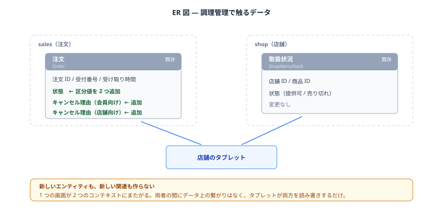

# <調理管理> — 詳細要件定義

## 用語 — 全体の用語集に追加する呼称
| 呼称（これで統一する） | 何を指すか | 言い換えない |
|---|---|---|
| 未受け取り | 受取準備完了のまま閉店を迎え、会員が受け取りに来なかった注文 | 「破棄」「ノーショー」 |
| 混雑 | その店舗で調理中の注文が閾値以上ある状態 | 「ピーク」「繁忙」 |

「未受け取り」と既存の「キャンセル」は、**作ったかどうか**で区別する。
作ったが渡せなかったものが未受け取り、作る前に取り消されたものがキャンセル。


## ER 図
**新しいエンティティも、新しい関連も作らない。**
`Order.Status` に区分値を 1 つ足すだけ。



1 つの画面が 2 つのコンテキストにまたがる。
注文と取扱状況の間にデータ上の繋がりはなく、タブレットが両方を読み書きするだけ。

## EntityModel

新しいエンティティは作らない。既存の `Order.Status` に区分値を 1 つ追加する。

```scala
// Order.Status に追加する
case IS_NOT_PICKED_UP extends Status(code = ?) // 未受け取り
```
**型では守れない決めごと**

- 未受け取りにできるのは受取準備完了の注文だけ。受付・調理中からは遷移できない
- 未受け取りは終端。ここから他の状態には戻らない

**状態遷移**

| 変更前 | 変更後 | きっかけ |
|---|---|---|
| 受付 | 調理中 | スタッフが「調理中」を押す |
| 調理中 | 受取準備完了 | スタッフが「受取準備完了」を押す |
| 受取準備完了 | 受渡し完了 | スタッフが「受け渡し完了」を押す |
| **受取準備完了** | **未受け取り** | **閉店時、スタッフが一括で操作する（今回追加）** |
| 受付 | キャンセル | 会員の取り消し |

**保存されるデータの例**

| 注文 ID | 受け取り時間 | 状態 | どうなったか |
|---|---|---|---|
| 3001 | 18:30 | 受渡し完了 | 時間どおり受け取られた |
| 3012 | 19:00 | **未受け取り** | 作ったが来なかった。閉店時に一括操作 |
| 3020 | 20:00 | キャンセル | 会員側でキャンセル |

## <判定ルール>

### 注文一覧の並び順

1. その店舗の注文のうち、受付・調理中・受取準備完了のものを集める
2. 調理中の件数を数える
3. 閾値以上なら、受け取り時間の近い順に並べる
4. 閾値未満なら、通常の並び順（受付が古い順）で返す

混雑かどうかは保存しない。一覧を返すたびに数えて判定する。

### 閉店時の一括操作

1. その店舗の注文のうち、受取準備完了のものを集める
2. すべて未受け取りにする


## 置き場所（コンテキスト）

**判断：** 新しいコンテキストは作らない。何も動かさない。

**理由：** 新しいエンティティを作らないため、置き場所を決める必要がない。
触るのは `sales` の `Order` と `shop` の `ShopMenuStock` で、どちらも既存の位置のまま。

調理管理という新しいコンテキストを作る案も検討したが、採らない。
作っても自分のモデルを1つも持たず、salesのOrderとshopのShopMenuStockを呼ぶだけになる。
配線だけが1セット増えるだけになるため。

---

# 付録A：今回やらないこと
- **スタッフのログイン・権限・シフト管理。**
タブレットは店舗ごとに設置され、店舗を選んで使う。誰が操作したかは記録しない
- **未受け取りにした注文の返金。**
支払いの状態は変更しない。返金は既存の運用に任せる
- **混雑判定の閾値の店舗別設定。** 全店舗共通の固定値とする
- **調理時間の記録・分析。** 「調理中」から「受取準備完了」までの所要時間は測らない


# 付録B：判断の記録

### 論点1：「混雑」を保存するか、都度計算するか

**判断：** 保存しない。一覧を返すたびに、調理中の注文数を数えて判定する。

店舗に「混雑中」というフラグを持たせる案もあった。
しかし混雑かどうかは調理中の件数から分かるので、保存すると同じ事実が2か所に現れる。
件数と食い違ったとき、どちらが正しいか判断できない。

スタッフが手で切り替える案も採らない。
いちばん忙しいときに操作を1つ増やすことになる。
切り替え忘れれば、並び順が実態と合わなくなる。

### 論点2：「未受け取り」を新しい区分値にするか、キャンセルで済ませるか

**判断：** 新しい区分値を追加する。

キャンセルで済ませれば区分値は増えない。
しかしそうすると、店舗が作らなかった注文と、作ったが取りに来られなかった注文が、同じ記録になる。

材料費が無駄になったのか、そもそも作っていないのかは、店舗にとって別の事実である。
売上の集計や廃棄の把握で区別が必要になる。

### 論点3：未受け取りにできる状態を、受取準備完了だけに限るか

**判断：** 限る。受付・調理中からは未受け取りにできない。

閉店時に受付や調理中のまま残っている注文は、店舗側が作れなかったということ。
これを未受け取りにすると、お客さんが来なかったという記録になり、事実と違う。

そもそもこの状態で閉店を迎えること自体が運用エラーなので、
システムとしては未受け取りにできないようにする。

### 論点4：新しいコンテキストを作るか

**判断：** 作らない。

タブレット向けの機能なので「調理管理」コンテキストを作る案もあった。
しかし作っても自分のモデルを1つも持たず、`sales` の `Order` と `shop` の `ShopMenuStock` を呼ぶだけになる。

1つの画面が2つのコンテキストにまたがるのは問題ではない。
画面の単位でモデルを分けると、既存のモデルを分断することになる。
