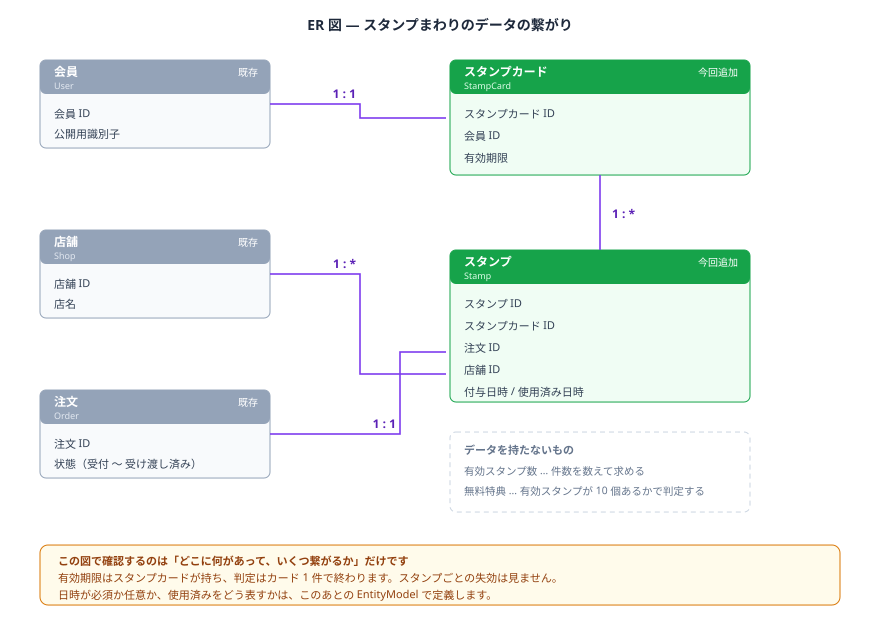

# <リワードカード>  — 詳細要件定義

呼称は日本語も英語もそろえる（→ 02_analysis.md / naming.md）。

## 用語 — 全体の用語集に追加する呼称
（**呼称をそろえる取り決め。個別の仕様書で用語を定義しない**。追加を申請する分だけ挙げる）
| 呼称（これで統一する） | 何を指すか | 言い換えない |
|---|---|---|
| スタンプ | 注文ごとに1個押され、特典交換に必要な数を数える単位 | ポイント、来店記録 |
| リワードカード | 種別が定める数のスタンプを貯める1枚。有効期限を持ち、特典交換の単位になる | スタンプカード、台紙、シート |
| リワード | カードの有効期間・必要スタンプ数・特典の内容を定めるマスタ（→ naming.md） | キャンペーン、プラン、スタンプカードの種別 |
| 配布期間 | リワードが持つ。この期間中に会員が最初のスタンプを得た場合だけ、その種別のカードができる | 開催期間（会員への案内文言としては使うが、モデルの呼称は配布期間で統一する） |
| 有効期限 | リワードカードが持つ、そのカードが使えなくなる日。できた日（＝最初のスタンプを得た日）＋種別が定める有効期間で確定する。以後延長しないが、期間限定の種別に参加すると開催期間の長さだけ加算される | 失効予定日、有効期間 |
| 使用状態 | 特典交換に使ったかどうかを表す。使用済み／未使用の2値 | 消化、消費済み |
| 有効スタンプ | 期限内かつ未使用のリワードカードに属するスタンプ | 残スタンプ、使えるスタンプ |
| 特典 | 必要スタンプ数を満たしたときに交換できるもの。全額無料／半額／金額割引（円）のいずれか1つをリワードが定める | クーポン、サービス券 |

## ER 図


## EntityModel

### <リワード（種別）>

本部が決めるマスタ。今回は作成のみを扱う（→ 付録A）。

```scala
case class Reward(
  id:                   Option[Id],           // 管理 ID（永続化前は None）
  name:                 String,                // 名称（例："通常スタンプ"、"サマースタンプ"）
  distributionStartAt:  Option[LocalDate],     // 配布期間の開始日。None なら常に配布中（通常スタンプ用）
  distributionEndAt:    Option[LocalDate],     // 配布期間の終了日。None なら終了日を定めない
  requiredStampCount:   Int,                   // カードが満杯になる数（例：10）
  cardValidityPeriod:   Period,                // カードができた日から数える有効な長さ（例：Period.ofYears(1)）
  bonusExtensionPeriod: Period,                // 満杯後の特典の有効期限を、カードの有効期限からどれだけ延ばすか（例：Period.ofMonths(1)）
  bonusType:            BonusType,             // 特典の種類（区分値）
  discountAmount:       Option[Int] = None,    // 割引額（円）。bonusType が IsAmountOff のときだけ Some
  updatedAt:            LocalDateTime = Now,   // データ更新日
  createdAt:            LocalDateTime = Now    // データ作成日
) extends EntityModel[Id]

object Reward:

  type   Id = Id.Repr
  object Id extends Entity.Id[Long]

enum BonusType:
  case IsFullyFree  // 全額無料
  case IsHalfPrice  // 半額
  case IsAmountOff  // 金額割引（円）。discountAmount を使う
```

### <リワードカード>

```scala
case class RewardCard(
  id:          Option[Id],                   // 管理 ID（永続化前は None）
  userId:      User.Id,                      // どの会員のカードか（User と *:1）
  rewardId:    Reward.Id,                     // どの種別のカードか（Reward と *:1）。期間限定の種別への参加で切り替わることがある
  expiredAt:   LocalDate,                    // このカードの有効期限。できた日 ＋ 種別の有効期間で確定し、以後延長しない（参加時の加算を除く）
  state:       RewardCardState = IsUnused,   // 使用状態（区分値）
  usedOrderId: Option[Order.Id] = None,      // このカードを特典交換に使った注文。未使用なら None
  usedAt:      Option[LocalDateTime] = None, // 特典交換に使用した日時。未使用なら None
  updatedAt:   LocalDateTime = Now,          // データ更新日
  createdAt:   LocalDateTime = Now           // データ作成日
) extends EntityModel[Id]

object RewardCard:

  type   Id = Id.Repr
  object Id extends Entity.Id[Long]

enum RewardCardState:
  case IsUnused  // 未使用
  case IsUsed    // 使用済み
```

### <スタンプ>

```scala
case class RewardCardStamp(
  id:           Option[Id],          // 管理 ID（永続化前は None）
  rewardCardId: RewardCard.Id,       // どのカードに押されたか（RewardCard と *:1）
  orderId:      Order.Id,            // どの注文で得たか（Order と 1:1）
  shopId:       Shop.Id,             // どの店舗での注文か（集計用。判定には使わない）
  updatedAt:    LocalDateTime = Now, // データ更新日
  createdAt:    LocalDateTime = Now  // データ作成日 ＝ 付与日時（受け渡し完了の時刻）
) extends EntityModel[Id]

object RewardCardStamp:

  type   Id = Id.Repr
  object Id extends Entity.Id[Long]
```

**ここで型が語っていること**

- `Reward` は変更を想定しない（作成のみ）。会員が持つ `RewardCard` は、できた時点の `rewardId` を参照し続ける
- `RewardCard.rewardId` は切り替わることがある（期間限定の種別への参加）。切り替わっても同じ1行を更新するだけなので、`RewardCardStamp` との関係（`rewardCardId`）は変わらない
- 必要スタンプ数・特典の内容・特典の延長期間を `RewardCard` 自身は持たない。常に `rewardId` をたどって `Reward` から読む。カードが切り替わればこれらの値も自動的に変わる
- `RewardCard.expiredAt` は保存する。種別の有効期間から都度計算しない理由は、期間限定の種別への参加による加算（あとから動く要素）を表現できないため（→ 付録B）
- `RewardCard.state` は `usedAt` の有無と同じ事実を2か所で持つ。管理側の集計要求を優先した判断で、更新は必ずセットで行う（→ 型では守れない決めごと、付録B）
- `RewardCardStamp` に変更はない。有効期限も区分値も持たない、追加専用の台帳
- `RewardCard.usedAt` の `None` が「未使用」の実体だが、絞り込みや一覧表示には `state` を使う
- `RewardCardStamp` は `userId` を持たない。`rewardCardId` からたどれるため
- `RewardCardStamp` は有効期限を持たない。期限はカード単位で一律なので `RewardCard` が持つ
- 有効スタンプ数を持たない。期限内かつ未使用のカードに属するスタンプを数えれば求まる
- 付与日時の専用カラムを持たない。スタンプは受け渡し完了の瞬間にしか作られないので、`createdAt` と必ず同じ値になる
- 交換した商品を持たない。商品券型（対象商品1点と交換、または割引）なので、選んだ商品は `OrderItem` にある
- 特典の対象になるかどうかは `MenuItem` 側のフラグで判定する。`Reward` は対象商品を持たない（種別には依らない）

**型では守れない決めごと**

- `state` と `usedAt` は必ず一致する（`state = IsUsed ⟺ usedAt.isDefined`）。
  更新は「使用済みにする」「差し戻す」の2つの操作関数にまとめ、`state` と `usedAt` を個別に書き換えない
- `usedOrderId` と `usedAt` は必ず両方埋まるか、両方 `None`。片方だけの状態は業務上ありえない
- `RewardCardStamp.orderId` は一意。1つの注文に対してスタンプは1個までしか作れない
- `RewardCardStamp.createdAt` が付与日時。**レコードを後から作り直してはいけません。**
  作り直すと付与日時が変わり、有効期限の起点がズレる
- `RewardCard.rewardId` は「期間限定の種別への参加」以外のタイミングで変更してはいけない
- 新しく作る `RewardCard` の `rewardId` は、その時点で配布期間内の種別でなければならない
- 期間限定の種別への参加による有効期限の加算は、いまの `expiredAt` に開催期間の長さを足す形で行う。作り直さない
- 1枚のカードに属するスタンプは、そのカードの `rewardId` が指す種別の `requiredStampCount` まで
- **1回の注文で交換できるのは1枚まで。** 満杯のカードを複数持っていても、特典が使えるのは1個
- `usedAt` を書き込めるのは、必要スタンプ数を満たしていて期限内のカードだけ
- 期限切れのカードと交換済みのカードは、期間限定の種別への参加があっても更新しない（一度切れたら戻らない）
- 部分的に埋まった（未使用・必要数未満の）カードは、常に最大1枚。満杯後に届いたスタンプは新しいカードに押される

**保存されるデータの例**（会員 A。種別「通常スタンプ」は必要数10・有効期間1年・特典は全額無料。
「サマースタンプ」は必要数8・特典の延長期間+2週間・特典は半額。2026-07-01〜2026-08-31に配布）

`Reward`

| id | name | requiredStampCount | cardValidityPeriod | bonusType |
|---|---|---|---|---|
| 1 | 通常スタンプ | 10 | 1年 | IsFullyFree |
| 2 | サマースタンプ | 8 | 3ヶ月 | IsHalfPrice |

`RewardCard`

| id | rewardId | expiredAt | state | usedOrderId | usedAt | どんなカードか |
|---|---|---|---|---|---|---|
| 11 | 1 | 2025-04-10 | IsUnused | `None` | `None` | 期限切れ。スタンプ7個のまま失効した |
| 12 | 1 | 2027-06-30 | IsUsed | 1120 | 2026-07-20 12:30 | 10個目を2026-06-30に押して満杯。注文1120で交換した |
| 13 | 2 | 2027-08-13 | IsUnused | `None` | `None` | もともと `rewardId=1`（有効期限2027-07-28）だったが、2026-07-10のスタンプ付与時にサマースタンプへの参加を選び、`rewardId` が2に切り替わって有効期限が16日延長された |

`RewardCardStamp`（カード13の分）

| rewardCardId | orderId | createdAt（＝付与日時） |
|---|---|---|
| 13 | 1120 | 2026-07-20 12:35 |
| 13 | 1131 | 2026-07-10 19:02 |

カード13は、必要スタンプ数がいま参照している種別（サマースタンプ、8個）に変わったため、
残り6個で満杯になる。有効スタンプ数の集計では `rewardId` は見ず、`state = IsUnused` かつ `expiredAt` が今日以降のカードに属するスタンプを数えるだけでよい。


## 区分値の考え方

**「使用状態」は区分値にする。** 管理側から「特典の利用実績を集計したい」という要求があるため。
集計・一覧のための列（`state`）と、個々の記録のための列（`usedOrderId` / `usedAt`）で役割を分ける
（→ 付録B）。

**「期限切れ」は区分値にしない。** 保存すると、日付が変わった瞬間に嘘になる。
毎日書き換えるバッチが必要になり、そのバッチが落ちた日は失効したはずのスタンプが使えてしまう。
`RewardCard.expiredAt` と今日を比べれば求まる。

**数の対象になるかどうかは、`state` と `expiredAt` の2つの属性で判定する。**

| expiredAt | state | そのカードのスタンプ |
|---|---|---|
| 今日以降 | IsUnused | **○ 数える** |
| 今日以降 | IsUsed | × 特典交換で消費済み |
| 今日より前 | — | × 失効。カードごと数えない |

判定は `RewardCard` の2列を見るだけで終わる。**スタンプを1件ずつ見て失効しているか調べる必要はない。**


## <複数のエンティティにまたがる判定ルール>

### いつ何をするか

| きっかけ | すること |
|---|---|
| 本部が種別を決めた | `Reward` を1行追加する（→ 付録A、作成のみ） |
| 注文を確定した（特典利用あり） | 期限内・未使用・必要スタンプ数を満たしているカードのうち最も古い1枚を `IsUsed` にし、`usedOrderId`・`usedAt` を書き込む（1注文につき1枚まで） |
| 特典を使った注文がキャンセルされた | その `usedOrderId` を持つカードを `IsUnused` に戻し、`usedOrderId`・`usedAt` を `None` にする |
| 商品を受け渡した（特典のみの注文でない） | 「どのカードに押すか」（次項）に従ってスタンプを1件記録する |
| 期限が切れた | **何もしない**（判定のたびにカードの `expiredAt` と今日を比べる） |

### どのカードに押すか

1. その会員の、期限内・未使用・必要スタンプ数（現在の `rewardId` が指す種別の値）未満のカードを探す（常に0枚か1枚）。
2. 見つかり、かつ現在配布期間内の期間限定の種別があり、そのカードの `rewardId` がまだそれになっていなければ、
   会員にその開催への参加を選べるようにする。
   - 参加を選べば、そのカードの `rewardId` を期間限定の種別に切り替え、`expiredAt` に開催期間の長さを加算する。
   - 参加しなければ、`rewardId` ・`expiredAt` は変えない。同じ開催中は次回以降選択画面を出さない
     （`rewardId` が既に切り替わっているかどうかで、参加済みかを判定できる）。
3. 見つかった（または切り替えた）カードにスタンプを1件記録する。
4. 見つからない場合、通常の種別が配布期間内であることを確認し、新しいカードを作る
   （`rewardId` ＝通常の種別、`expiredAt` ＝今日 ＋ 通常種別の `cardValidityPeriod`）。そこにスタンプを記録する。

### 有効スタンプ数の求め方

1. その会員のカードのうち、`expiredAt` が今日以降かつ `state = IsUnused` のものを集める
2. それらのカードに属するスタンプの件数を合計する

現在の `rewardId` が指す種別の必要スタンプ数以上あれば、特典が使える。


## 置き場所（コンテキスト）

**リワード（`Reward`）の判断：`common` に置く。**

理由：本部が管理し、業務の操作（注文）のたびには変わらず、`RewardCard` から参照される側にある。
common の3条件をすべて満たす（→ 02_analysis.md）。

**リワードカード・スタンプの判断：既存の `sales` コンテキストに置く。**

理由：日常的に書き換えるのは会員と店舗スタッフで、`Cart` / `Order` と同じ人・同じ画面・同じ頻度。
書き換えるきっかけも注文の確定・受け渡しであり、注文フローの一部として動く。

`RewardCard` が `Reward.Id` を持つのは `sales → common` の参照であり、逆流ではない
（`OrderItem` が `MenuItem.Id` を持つのと同じ形）。

`udb` には置けない。`Order.Id` を参照する側のため、`udb → sales` の逆流が生まれる。
既存の参照はすべて `sales` または `shop` が始点で、`udb` は参照される側にある。

---

# 付録A：今回やらないこと

- **有効期限が近いことのお知らせ通知。** 会員がアプリを開いたときに有効期限を表示するだけにする
- **スタンプの譲渡・合算。** 会員間で受け渡す仕組みは作らない
- **1注文で複数個のスタンプを押す運用。** 金額や点数に応じた加算はしない
- **期限切れカード・スタンプの物理削除。** 期限切れのカードは数えないだけで、レコードは残す
- **店舗ごとのスタンプ発行数の集計画面。** `shopId` は持つが、画面は作らない
- **無料特典を「権利」として記録すること。** 有効スタンプの件数から判定する
- **スタンプ以外の特典（誕生日特典など）。** マスタ（`Reward`）の形はそのまま使える見込みだが、今回は作らない
- **種別の編集・削除。** 本部による作成のみを扱う。配布期間の変更や特典内容の修正は今回のスコープ外
- **複数の期間限定の種別が同時に配布期間中であること。** 重ならない前提で進める
- **期間限定の種別への参加を取り消す（オプトアウトする）機能。** 一度参加を選んだら、その開催中は解除できない
- **発行されたら消える実際のクーポン券。** `Coupon` という語は空けておく（→ naming.md）


# 付録B：判断の記録

#### リワードカードをエンティティにするか、有効期限を計算で求めるか

判断は `RewardCard` を作り、有効期限を保存する。

要件で「できた日＋種別の有効期間で確定し、以後延長しない」に確定した（→ 01_requirements.md）。
一律の値ということは、そのカードの期限はできた時点で決まる1つの値になる。
1つしかない値を10行に分散させるのは重複であり、判定もカードの2列を見るだけで終わる。

もし要件が「スタンプごとに押した日から1年」だったら、期限は1件ずつ違う値になるので `RewardCardStamp` が持つのが正しく、
カードは不要だった。**この分岐が `RewardCard` を作った理由のすべてである。**

#### リワードカードを会員につき1枚にするか、複数枚にするか

判断は複数枚。必要スタンプ数を満たして満杯になったら、次のスタンプは新しいカードに押す。

1枚だと、期限切れの後に来店したとき `expiredAt` が未来へ更新され、
失効したはずのスタンプが復活してしまう。複数枚なら、期限切れのカードを更新しないだけで済む。
古いカードのスタンプには構造上たどれないので、復活が起こりえない。

代償として、押す先のカードを毎回決める処理と、「1枚は種別が定める必要数まで」という型で守れない制約が増えた。

#### 付与日時を専用のカラムで持つか、`createdAt` で足りるか

判断は `createdAt` で足りる。専用のカラムは作らない。

スタンプは受け渡し完了の瞬間にしか作られない。付与のタイミングとレコード作成のタイミングが
常に一致するため、専用カラムを足しても `createdAt` と同じ値が入るだけになる。

#### カードの有効期限を、できた時点で固定するか、注文のたびに延長するか

判断は固定する。できた日＋種別が定める有効期間で確定し、以後は延長しない
（期間限定の種別への参加を除く）。

注文のたびに延長する案もあった。しかし種別ごとに「この期間だけ有効」と定めたい以上
（→ 01_requirements.md の追加要求）、注文ごとに動く延長ロジックはその定義を壊す。
また延長する設計では、満杯のカードを延長し続けると特典が永久に消えなくなるため、
「満杯後だけ延長を止める」という例外が必要になる。固定なら、満杯かどうかで扱いを分ける理由がない。

例外として期間限定の種別への参加だけは加算する。これは注文のたびに自動で起こるものではなく、
会員が選んだときに一度だけ起こる、別種の操作だからである。

#### 期間限定の種別への参加を、新しいカードを作る形にするか、いまのカードの種別を切り替える形にするか

判断は切り替える。新しいカードは作らない。

「会員が同時に持てる進行中のカードは常に1枚」という制約があるため（→ 01_requirements.md）、
別カードを作ると2枚を並行して持つことになり、この制約に反する。
`rewardId` を切り替えれば、カードは1行のまま、必要スタンプ数・特典の内容・有効期限の基準だけが変わる。
それまでに貯めたスタンプ（`rewardCardId` で紐づく `RewardCardStamp`）もそのまま持ち越される。

代償は、`RewardCard.rewardId` が可変になったこと。「型では守れない決めごと」に、
切り替えていいタイミングを明記する必要が生まれた。

#### 使用済み日時をスタンプに持つか、リワードカードに持つか

判断はカードに持つ。

交換は必要スタンプ数まとめての1回なので、スタンプに持つと同じ値が複数行に重複する。
1枚のカードにつき交換は1回だけなので、カードの属性として過不足なく収まる。

結果として `RewardCardStamp` から `Option` が消え、`id` 以外はすべて必須になった。
スタンプは「いつどの注文で得たか」だけの台帳になり、状態を持たない。

#### スタンプの消費と付与を、同じタイミングにするか

判断は揃えない。消費は注文確定時、付与は受け渡し完了時。

付与を支払い完了時にすると、商品を受け取っていない注文でスタンプが増え、
受け取らずに特典だけ取れてしまう。付与は「受け取った事実」への対価なので、受け渡しの後になる。

消費を受け渡し時にすると、必要数を持った状態で2件注文したときに両方へ特典を適用できてしまう。
消費は「使う宣言」なので、注文確定の時点で押さえる。

この非対称の結果、キャンセルによるスタンプの無効化が不要になった（受け渡し前のスタンプは存在しない）。

#### 「使用済み」を区分値にするか、日時の有無で表すか

判断は両方持つ。`state`（区分値）と `usedAt`（日時）を両方保存する。

日時の有無だけで表す案もある。「いつ交換したか」は問い合わせ対応で必要なので日時は結局持つことになり、
`usedAt IS NOT NULL` で集計もできる。この案なら同じ事実が1か所に収まる。

それでも `state` を足したのは、管理側から「特典の利用実績を集計したい」という要求が出たため。
集計・一覧表示のための列と、個々の記録（いつ・どの注文で）のための列の役割を分ける。

代償は、同じ事実を2か所に持つことで「`state` は使用済みなのに `usedAt` が空」という矛盾が作れてしまうこと。
型で防げないため、更新を「使用済みにする」「差し戻す」の2つの操作関数に絞り、
`state` と `usedAt` を必ずセットで書き換えることを実装上のルールとする（→ 型では守れない決めごと）。

#### 使った注文の ID を持つか

判断は `usedOrderId` を持つ。

`state` や `usedAt` だけでは、特典を使った注文がキャンセルされたときに戻すカードを特定できない。
問い合わせで「この特典はどの注文で使ったか」に答えるためにも必要になる。

#### 期限切れを書き込むか、判定だけにするか

判断は書き込まない。表示や注文確定のたびにカードの `expiredAt` と今日を比べる。

書き込む案は毎日走るバッチが必要になり、そのバッチが落ちた日は失効したはずのスタンプが使えてしまう。
比べれば分かるものは保存しない。

#### 「無料特典」をエンティティにするか

判断は作らない。有効スタンプ数が、現在の種別が定める必要数以上あるかで判定する。

エンティティにすれば「必要数を満たした」という権利確定の事実を保存でき、その後スタンプが失効しても特典を残せる。
しかし要件定義で「特典もカードと同様、カードの有効期限＋延長期間で使えなくなる」と確認しているため、
カードが失効したら特典も消えてよい。

特典の内容が「全額無料・半額・金額割引（円）」の3種類に増えたが、これは `Reward` の属性
（`bonusType` / `discountAmount`）を増やすだけで表現できた。特典ごとに件数や残額を管理する必要がないため、
エンティティを新設する理由には至らない。

**代案：`Coupon` を新設する。** マスタを `Reward` にしたことで、誕生日特典のようなスタンプを使わない発行理由も
同じ枠に収まる見込みが立った（→ naming.md）。それでも表現できない発行理由（発行されたら消える実際のクーポン券など）
が要件に入った時点で、この代案を検討する。

#### リワード（種別）をマスタにするか、`RewardCard` の属性として複製するか

判断はマスタにする。`Reward` を新設し、`RewardCard` は `rewardId` で参照する。

要件で「保有スタンプはマスタで管理したい」「種別ごとに有効期限を設定したい」と確認している
（→ 01_requirements.md）。複数の `RewardCard` が同じ種別の設定（必要数・有効期間・特典）を共有するため、
属性として複製すると同じ設定が `RewardCard` の行数だけ重複し、種別の設定を直そうとすると全行の更新が必要になる。
マスタにすれば、`Reward` の1行を直すだけで済む（今回は作成のみのため実際には更新しないが、
将来変更を許すとしても影響範囲が閉じる）。

#### 特典の対象商品を、リワードの属性にするか、商品の属性にするか

判断は商品（`MenuItem`）の属性にする。

要件で「対象範囲は種別ではなく商品ごとに決める」と確認している（→ 01_requirements.md）。
種別側に対象商品のリストを持たせると、種別の数だけ「どの商品が対象か」を管理する場所が増え、
同じ商品を複数の種別で個別に登録し直す必要が生まれる。商品側に1つのフラグを持たせれば、
種別が何個に増えても対象商品の判定は変わらない。

#### マスタと保有カードを、同じ語根（`Reward`）でつなぐか、別の語根にするか

判断は同じ語根でつなぐ。`Reward` / `RewardCard` / `RewardCardStamp`。

`Stamp` を語根にすると、最上位と中間の両方に `Stamp` が現れ、深い階層ほど名前が短くなる。
`Cart` < `CartItem` < `CartItemOption` とは逆向きの並びになり、階層を取り違えやすい。
`Stamp` を末端の1語に限定し、上位2階層を別の語根から組み立てることで、深いほど長くなる並びに直した。

日本語の呼称も英語に合わせた。要求文にある語は「スタンプ」だけで、
カードやその種別を業務が何と呼ぶかは確認できていない。
確認できていない語を業務語として扱わないほうが、後で食い違わない（→ 01_requirements.md の質問リスト）。
評価軸・候補・却下理由は `naming.md`。
